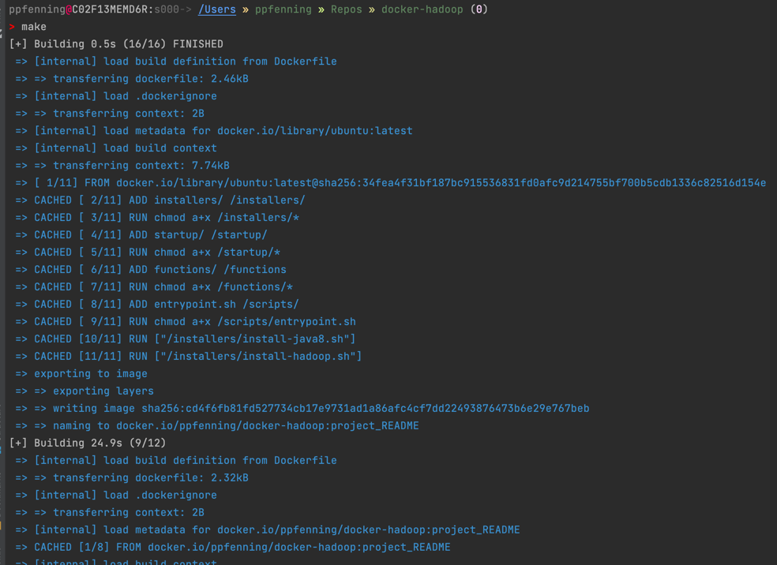
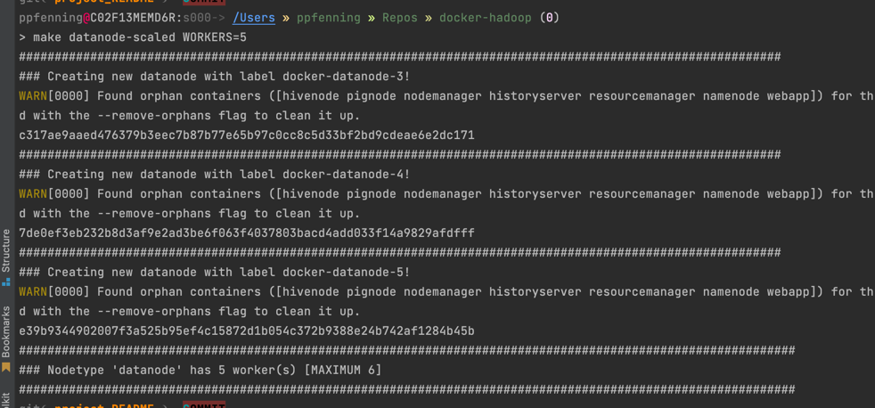

<div id="top"></div>
<!--
*** Thanks for checking out the Best-README-Template. If you have a suggestion
*** that would make this better, please fork the repo and create a pull request
*** or simply open an issue with the tag "enhancement".
*** Don't forget to give the project a star!
*** Thanks again! Now go create something AMAZING! :D
-->

<!-- PROJECT SHIELDS -->
<!--
*** I'm using markdown "reference style" links for readability.
*** Reference links are enclosed in brackets [ ] instead of parentheses ( ).
*** See the bottom of this document for the declaration of the reference variables
*** for contributors-url, forks-url, etc. This is an optional, concise syntax you may use.
*** https://www.markdownguide.org/basic-syntax/#reference-style-links
-->
[![Contributors][contributors-shield]][contributors-url]
[![Forks][forks-shield]][forks-url]
[![Stargazers][stars-shield]][stars-url]
[![Issues][issues-shield]][issues-url]
[![LinkedIn][linkedin-shield]][linkedin-url]

<!-- PROJECT LOGO -->
<br />
<div align="center">
  <a href="https://github.com/ppfenning/docker-hadoop">
    
  </a>

<h1 align="center">Docker Hadoop</h3>

  <p align="center">
    A "stackable" Hadoop network with simple setup and teardown!
    <br />
    <a href="https://github.com/ppfenning/docker-hadoop"><strong>Explore the docs »</strong></a>
    <br />
    <br />
    <a href="https://github.com/ppfenning/docker-hadoop">View Demo</a>
    ·
    <a href="https://github.com/ppfenning/docker-hadoop/issues">Report Bug</a>
    ·
    <a href="https://github.com/ppfenning/docker-hadoop/issues">Request Feature</a>
  </p>
</div>


<!-- ABOUT THE PROJECT -->
## About The Project

[![Docker Hadoop][product-screenshot]](https://example.com)

Hadoop is a distributed computing solution developed in 2002 by the [Apache Software Foundation](https://apache.org/). 
Hadoop relies on nodes of a cluster to distribute data via a Map-Reduce structure. The main components of Hadoop are:

* __Namenode:__ The _master_ node which splits tasks to other nodes.

* __Datanode(s):__ A _slaves_ to the __namenode__, to carry out computation

* __Hadoop Distributed File System _(HDFS)_:__ A file system which is accessible by all nodes in the system. 

* __Yet Another Resource Manager _(YARN)_:__ Manages resources and scheduling for the network

Additionally, there exist many supplementary software solutions for Hadoop ([Look Here](https://dlcdn.apache.org)), but we will be focusing on the following:

* __Spark:__ A multi language solution which can sit on top of __Hadoop,__ or replace it entirely. Mainly used as a _Scala_ or _Python_ tool.
* __Hive:__ A _JDBC_ data warehouse solution which allows the user to query data in __HDFS__ using _SQL._
* __Pig:__ Simple shell for performing map-reduce problems on HDFS or locally.

## Proposal

### Problem

>Hadoop can be distributed over either a physical or virtual cluster, but most commonly requires the use of __SSH__ to transfer data between nodes.
This requires setup on each node and is often semi-automated or completely manual. The system has a defined set of _home_ nodes across the cluster.
This is a delicate task, which can take many man-hours to complete.

### __Solution:__ 

> Employ Docker to **containerize** this process.

### Why Docker?

Docker utilizes __images__ which can be deployed on almost any OS. It utilizes layers to parse out instructions to each container. Instructions
are loaded into the __image__ at the build step, allowing only the software which is necessary to the system. When the __image__ is deployed it follows 
the stored recipe, allowing for simple configuration without the fear of dependency issues. These configured __containers__ can be stopped and started 
with a simple command `docker up` or `docker down`. Because each node in our system requires __Hadoop__ to be installed, can reuse a set __hadoop__ image, with differing startup commands. 

Docker Compose simplifies this process even further, by allowing for _yaml_ based configuration of multiple nodes at once. Additionally all deployed nodes are placed within a subnet created at
runtime. This means each node can "see" each other within the `localhost` and thus can give instructions without the use of SSH. Composing creates a __stack__ 
which can be monitored and managed via a single interface. Nodes can be scaled up or down depending on user needs. Because it is virtualized, there is no need to fear 
breaking the network, as it can be rebuilt simply on the stack.

<p align="right">(<a href="#top">back to top</a>)</p>


<!-- GETTING STARTED -->
## Getting Started

This is an example of how you may give instructions on setting up your project locally.
To get a local copy up and running follow these simple example steps.

### Prerequisites

This is an example of how to list things you need to use the software and how to install them.

* [docker-compose](https://docs.docker.com/compose/install/) _or with_ `pip install docker-compose`
* [VirtualBox](https://www.virtualbox.org/wiki/Downloads)
* [Git](https://git-scm.com/book/en/v2/Getting-Started-Installing-Git) 

#### Helpful (but not needed) tools

* [Docker Desktop](https://www.docker.com/products/docker-desktop/)
* [Portainer](https://www.portainer.io/install-BE-now)

### Installation

1. Clone the repo
   ```sh
   git clone https://github.com/ppfenning/docker-hadoop.git
   ```
2. Change directories to the install repo
   ```sh
   cd docker-hadoop
   ```

## Images:

1. [Docker Hadoop](https://hub.docker.com/repository/docker/ppfenning/docker-hadoop): The base image which other images are build from. This image uses
the latest release of __Ubuntu.__ and only installs Java 8 and Hadoop 3.3.3. It should be noted that all software versions can be changed via configuration files.
1. [Docker Pig](https://hub.docker.com/repository/docker/ppfenning/docker-hadoop-pig): Installs Pig 0.17.0
2. [Docker Hive](https://hub.docker.com/repository/docker/ppfenning/docker-hadoop-hive): Installs Hive 3.1.3.

## Containers:

1. __Namenode:__ First node to start. Prerequisite for any other node type. Uses `docker-hadoop`.
1. __Datanode:__ Slave to __namenode__. Intended to be scaled up or down based on workload. Uses `docker-hadoop`.
2. __Resource Manager:__ _YARN_ node which tracks tasks from __namenode.__ Uses `docker-hadoop`.
2. __Node Manager:__ _YARN_ node which tracks activity and heartbeat of all other nodes. Uses `docker-hadoop`.
2. __Pignode:__ Single node which sits atop of HDFS. Add-on to __namenode.__ Access to `grunt` shell. Uses `docker-hadoop-pig`.
2. __Hivenode:__ Single node which sits atop of HDFS. Add-on to __namenode.__ Access to `beehive` shell. Uses `docker-hadoop-hive`.

## Deployment:

Go to the repo directory

1. Initialize:
    - Build local images from scratch: `make`
    - Pull from prebuild images: `make LOCAL=0`
> **_NOTE:_**  This command will build all necessary images and bring the network online



2. Scale Datanodes: `make datanode-scaled WORKERS={DESIRED NODE COUNT}`



### Entrypoints:


<p align="right">(<a href="#top">back to top</a>)</p>

<!-- TODO -->
## Roadmap

- [X] Hadoop single namenode
- [x] Namenode with single datanode
- [x] Namenode with 2 datanodes
- [x] Namenode with _N_ datanodes __(max 6)__
- [x] Resource and Node managers
- [x] History server
- [x] Pig terminal node
- [x] Hive terminal node
- [x] Scale datanodes dynamically
- [X] Example Compose files to run jobs
- [X] Terminal endpoints for
  - [X] Hadoop
  - [X] Pig
  - [X] Hive
  - [ ] Spark
- [ ] Build with spark backend
- [ ] Create CLI rather than just Makefile

See the [open issues](https://github.com/ppfenning/docker-hadoop/issues) for a full list of proposed features (and known issues).

<p align="right">(<a href="#top">back to top</a>)</p>


<!-- CONTRIBUTING -->
## Contributing

Contributions are what make the open source community such an amazing place to learn, inspire, and create. Any contributions you make are **greatly appreciated**.

If you have a suggestion that would make this better, please fork the repo and create a pull request. You can also simply open an issue with the tag "enhancement".
Don't forget to give the project a star! Thanks again!

1. Fork the Project
2. Create your Feature Branch (`git checkout -b feature/AmazingFeature`)
3. Commit your Changes (`git commit -m 'Add some AmazingFeature'`)
4. Push to the Branch (`git push origin feature/AmazingFeature`)
5. Open a Pull Request

<p align="right">(<a href="#top">back to top</a>)</p>

License
=======
    Copyright 2022 Patrick Pfenning

    Licensed under the Apache License, Version 2.0 (the "License");
    you may not use this file except in compliance with the License.
    You may obtain a copy of the License at

       http://www.apache.org/licenses/LICENSE-2.0

    Unless required by applicable law or agreed to in writing, software
    distributed under the License is distributed on an "AS IS" BASIS,
    WITHOUT WARRANTIES OR CONDITIONS OF ANY KIND, either express or implied.
    See the License for the specific language governing permissions and
    limitations under the License.

<p align="right">(<a href="#top">back to top</a>)</p>


<!-- CONTACT -->
## Contact

- Patrick Pfenning - Data Science Master's candidate at Wentworth - ppfenning@wit.edu
- Github: [ppfenning](https://github.com/ppfenning)
- Project Link: [docker-hadoop](https://github.com/ppfenning/docker-hadoop)

<p align="right">(<a href="#top">back to top</a>)</p>

<!-- ACKNOWLEDGMENTS -->
## Acknowledgments

Use this space to list resources you find helpful and would like to give credit to. I've included a few of my favorites to kick things off!

* [Big Data Europe Repo](https://github.com/big-data-europe/docker-hadoop)
> This project was forked from Big Data Europe's repo. I couldn't have completed this without the base
* [The Apache Software Foundation](https://apache.org/)
> [Hadoop](https://hadoop.apache.org/), [Spark](https://spark.apache.org/), [Pig](https://pig.apache.org/) and [Hive](https://hive.apache.org/) are all open source Apache solutions!
* [Docker Cheatsheet](https://dockerlabs.collabnix.com/docker/cheatsheet/)
> I learned a ton about docker in this project...
* [phoenixNAP](https://phoenixnap.com/kb/)
> Helped a ton with property setup
* [Makefile Tutorial](https://makefiletutorial.com/)
* [Salem Othman](https://wit.edu/salem-othman) 
> My professor for Big Data Systems


<p align="right">(<a href="#top">back to top</a>)</p>


<!-- MARKDOWN LINKS & IMAGES -->
<!-- https://www.markdownguide.org/basic-syntax/#reference-style-links -->
[contributors-shield]: https://img.shields.io/github/contributors/ppfenning/docker-hadoop.svg?style=for-the-badge
[contributors-url]: https://github.com/ppfenning/docker-hadoop/graphs/contributors
[forks-shield]: https://img.shields.io/github/forks/ppfenning/docker-hadoop.svg?style=for-the-badge
[forks-url]: https://github.com/ppfenning/docker-hadoop/network/members
[stars-shield]: https://img.shields.io/github/stars/ppfenning/docker-hadoop.svg?style=for-the-badge
[stars-url]: https://github.com/ppfenning/docker-hadoop/stargazers
[issues-shield]: https://img.shields.io/github/issues/ppfenning/docker-hadoop.svg?style=for-the-badge
[issues-url]: https://github.com/ppfenning/docker-hadoop/issues
[license-shield]: https://img.shields.io/github/license/ppfenning/docker-hadoop.svg?style=for-the-badge
[license-url]: https://github.com/ppfenning/docker-hadoop/blob/master/LICENSE.txt
[linkedin-shield]: https://img.shields.io/badge/-LinkedIn-black.svg?style=for-the-badge&logo=linkedin&colorB=555
[linkedin-url]: https://linkedin.com/in/patrick-pfenning
[product-screenshot]: media/intro/screen-shot.png
[Next.js]: https://img.shields.io/badge/next.js-000000?style=for-the-badge&logo=nextdotjs&logoColor=white
[Next-url]: https://nextjs.org/
[React.js]: https://img.shields.io/badge/React-20232A?style=for-the-badge&logo=react&logoColor=61DAFB
[React-url]: https://reactjs.org/
[Vue.js]: https://img.shields.io/badge/Vue.js-35495E?style=for-the-badge&logo=vuedotjs&logoColor=4FC08D
[Vue-url]: https://vuejs.org/
[Angular.io]: https://img.shields.io/badge/Angular-DD0031?style=for-the-badge&logo=angular&logoColor=white
[Angular-url]: https://angular.io/
[Svelte.dev]: https://img.shields.io/badge/Svelte-4A4A55?style=for-the-badge&logo=svelte&logoColor=FF3E00
[Svelte-url]: https://svelte.dev/
[Laravel.com]: https://img.shields.io/badge/Laravel-FF2D20?style=for-the-badge&logo=laravel&logoColor=white
[Laravel-url]: https://laravel.com
[Bootstrap.com]: https://img.shields.io/badge/Bootstrap-563D7C?style=for-the-badge&logo=bootstrap&logoColor=white
[Bootstrap-url]: https://getbootstrap.com
[JQuery.com]: https://img.shields.io/badge/jQuery-0769AD?style=for-the-badge&logo=jquery&logoColor=white
[JQuery-url]: https://jquery.com 
[repo-url]: https://github.com/ppfenning/docker-hadoop